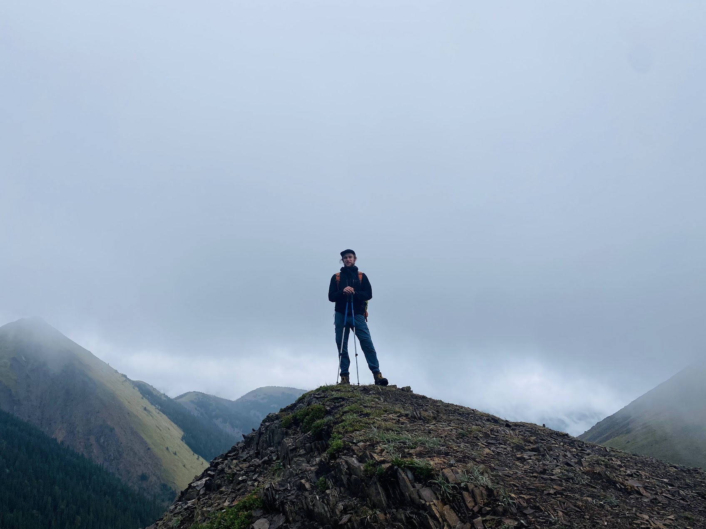
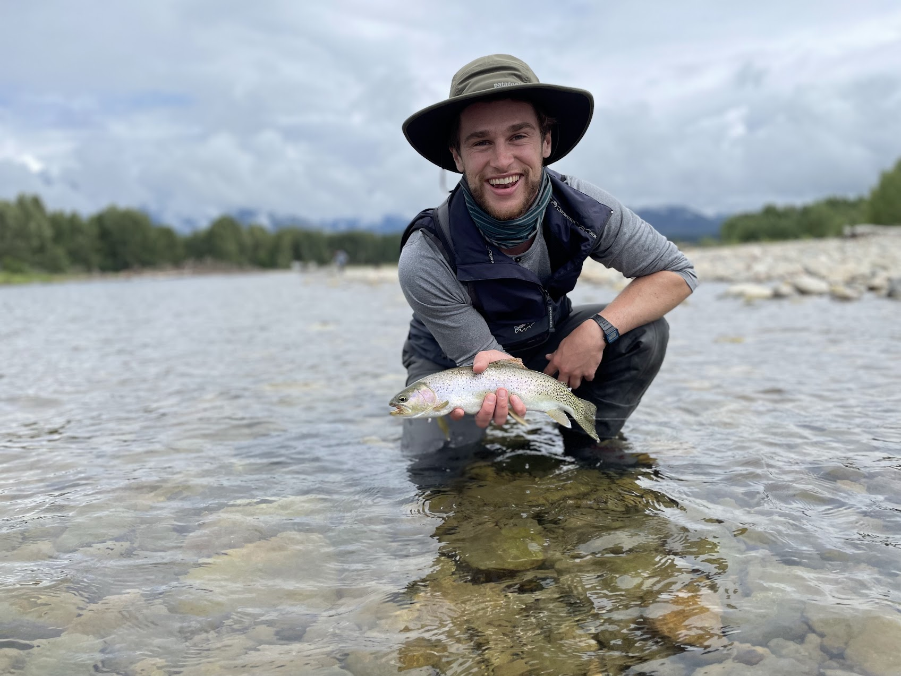
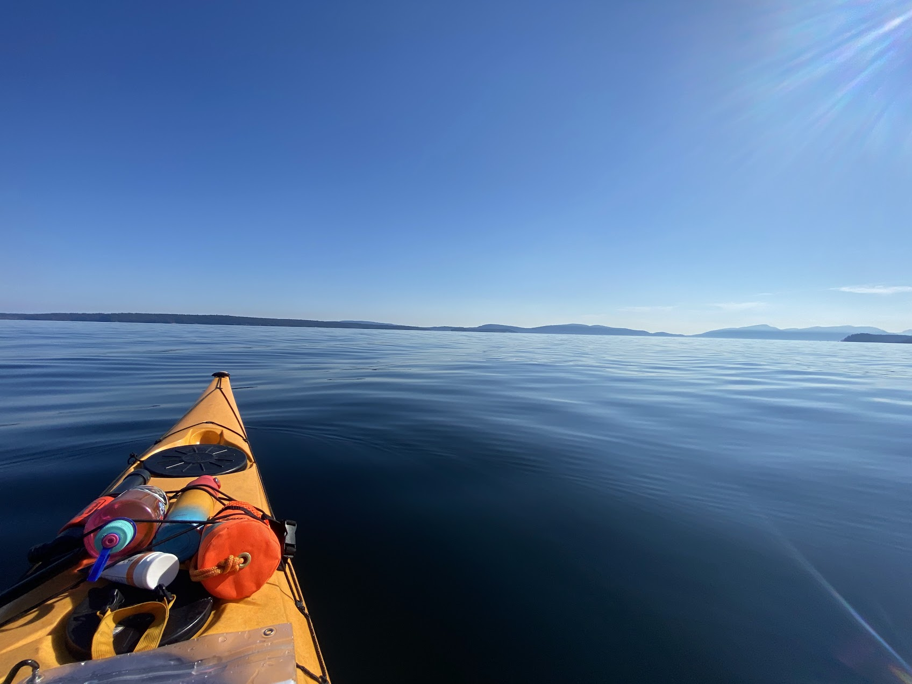

---

Hi! A little more about me:

I love being outside an am an avid hiker, kayaker, biker, canoer, fisher, birder, botanist, climber, among other recreational pursuits!

:::: {.columns}

::: {.column}
{width="100%"}
:::

::: {.column}
{width="100%"}
:::

::: {.column}
{width="100%"}
:::

::: {.column}
{width="100%"}
:::

::::

---

When I am not outside, I love reading books, playing a variety of board games, wandering around local venues, and thrifting clothes.

Nerdily enough, I have a fascination with rare plants and birds and will always plan a stop on a trip (or an entire trip) to try to see different species I have never seen before.

:::: {.columns}

::: {.column}
{width="100%"}
:::

::: {.column}
{width="100%"}
:::

::: {.column}
{height="532px" width="400px"}
:::

::: {.column}
{width="100%"}
:::

::::

---

Finally, you will likely see me with my film camera - where I focus mainly on the very small (macro) or the very large (landscapes).

:::: {.columns}

::: {.column}
{width="100%"}
:::

::: {.column}
{width="100%"}
:::

::: {.column}
{width="100%"}
:::

::: {.column}
{width="100%"}
:::

::: {.column}
{width="100%"}
:::

::: {.column}
{width="100%"}
:::

::: {.column}
{width="100%"}
:::

::: {.column}
{width="100%"}
:::

::::

---

