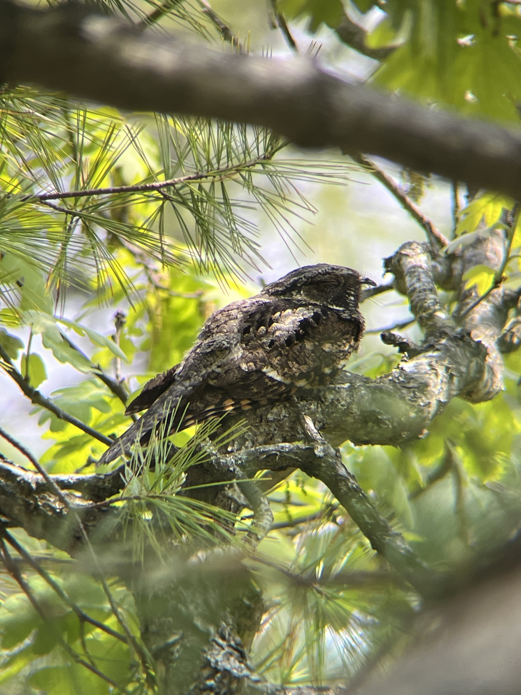
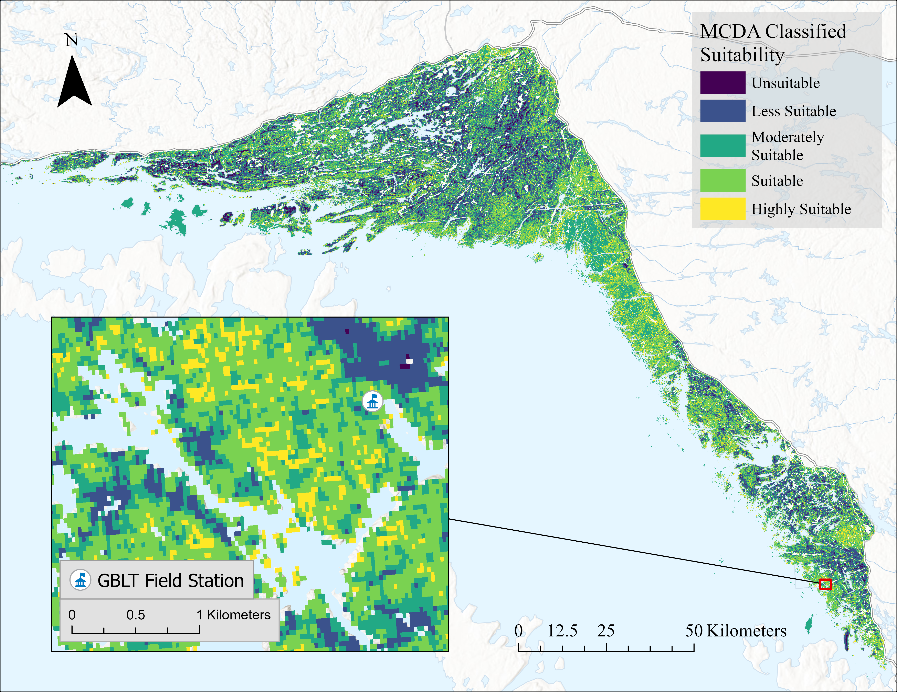

## Summary of Program

From August 2025 – April 2026, I completed the MGEM program at the University of British Columbia. In this program we dove into advanced geospatial topics including, but not limited to:

- Hydrological analysis and linear referencing
- Least cost analysis and multi-criteria analysis
- Lidar, raster, sf object, and time series analysis in python and R
- Data manipulation, quality assurance, and data cleaning in python and R
- Academic writing, professional conduct, and ethics
- Project creation, analysis, and reporting

---

## Capstone Project
### Predicting suitable habitat using MaxEnt and MCDA for the Eastern Whip-poor-will

A core part of this program is the capstone project, where I created and compared two habitat suitability models for the Eastern Whip-poor-will in Eastern Georgian Bay, Ontario.

{fig-cap="Eastern Whip-poor-will roosting" width="60%" fig-align="center" fig-number=false}

--- 

In this project I compiled known locations of Whip-poor-will presence and a variety of environmental predicting variables (e.g. forest structure, tree species, distance to openings and water, etc) to create two suitability models: Maximum Entropy (MaxEnt) and Multi-Criteria Decision Analysis (MCDA).

MaxEnt is a machine learning algorithm that relates known presence locations to the surrounding environmental variables. In constrast, MCDA relies on expert knowledge to define suitability thresholds and weights of environmental variables.

:::: {.columns}

::: {.column width="50%"}
{width="100%"}
:::

::: {.column width="50%"}
{width="100%"}
:::
::::

The end product are two maps that represent the spatial distribution of suitable habitat for the Eastern Whip-poor-will.
These maps are then subtracted from one another to elucidate areas of similarity and dissimilarity between the two models.

High suitability areas in either model were evaluated for future conservation easements by the Georgian Bay Land Trust.

More information on my capstone project:
[Report](https://paulhetgrieve.github.io/wpw_capstone/)

---

## Other Projects

### 1. LiDAR Forest Structure Analysis – Alex Fraser Research Forest

Developed a suite of LiDAR-derived forest products for the Alex Fraser Research Forest using discrete-return airborne LiDAR data and field plot measurements. A digital elevation model (DEM) and canopy height model (CHM) were generated at 2 m resolution, and LiDAR metrics were used to build statistical models predicting total aboveground biomass and dominant tree height. The final models were applied across the landscape to produce wall-to-wall spatial predictions of forest structure and biomass.

[Report](https://paulhetgrieve.github.io/LIDAR_AKRF/)

### 2. Grizzly Bear Movement Corridors – Least Cost Path Analysis

Modeled potential grizzly bear movement corridors across the Rocky Mountain foothills of western Alberta using raster-based least cost path analysis. Environmental predictors including slope, land cover, and distance to roads were converted into movement cost surfaces and combined into a weighted resistance model. The final analysis identified the lowest-cost travel route between core habitat areas, highlighting how landscape features and human disturbance influence wildlife connectivity.

[Report](https://paulhetgrieve.github.io/Least_Cost_Analysis/)

### 3. Old-Growth Forest Assessment – Vancouver Island

This project analyzes the distribution of old-growth forests across Vancouver Island using the Vegetation Resource Inventory (VRI) dataset and cartographic modelling techniques. Forest stands were classified into seral stages based on age and biogeoclimatic zone, and intersected with land ownership, disturbance, and landscape unit boundaries. The final analysis calculated the percentage of old growth within each landscape unit and compared these values to provincial biodiversity targets to identify areas where conservation objectives are being met or exceeded.

[Report](https://paulhetgrieve.github.io/oldgrowth_locations/)

