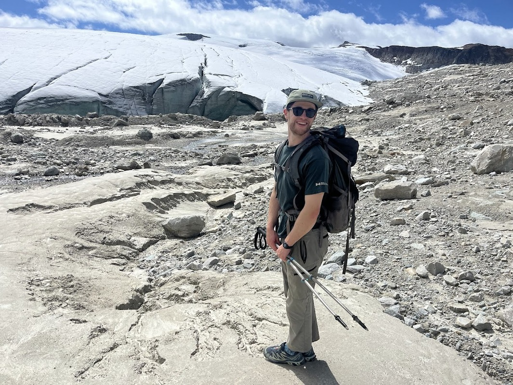
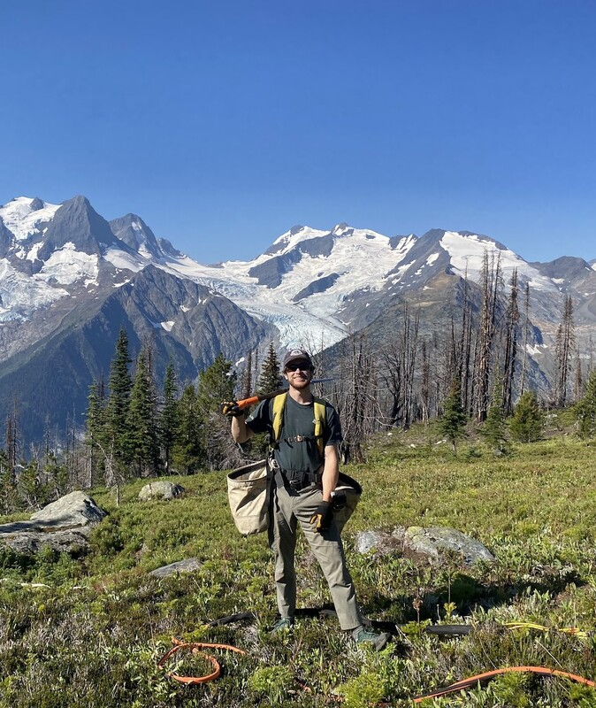
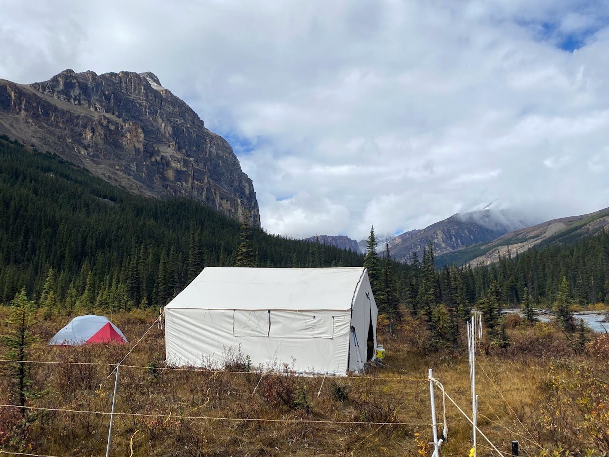
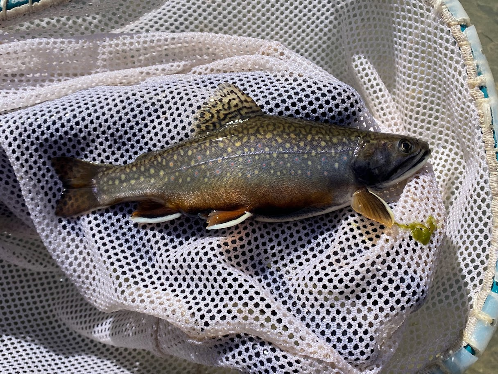
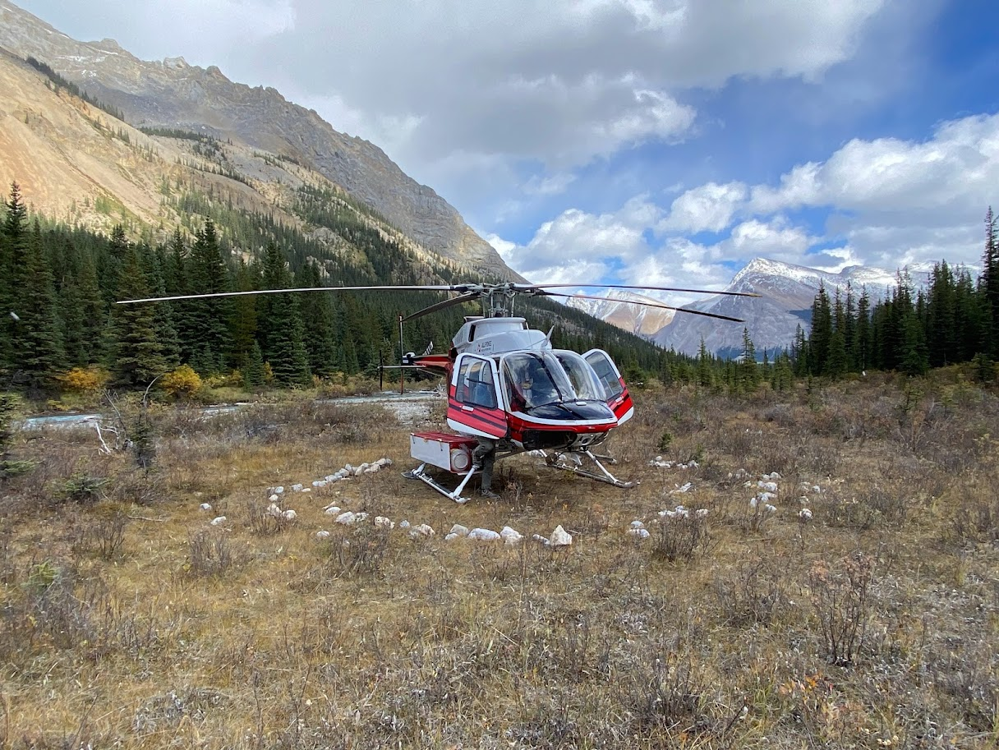

## Executive Statement

Since 2020, I have worked in the Resource Management Department of Parks Canada in three National Parks: Banff, Glacier, and Revelstoke. In the Resource Management Department I have worked within Freshwater Aquatics, Fire and Vegetation, Wildlife Coexistence, and Ecological Integrity Monitoring teams. Within all of these roles I was responsible for the collection, maintenance, and analysis of geospatial data concerning a variety of habitats and projects.

Outside of resource conservation, I have experience working as a receptionist, cashier, barista, social media director, and fundraiser.

{fig-align="center" width="60%" fig-cap="Pearly Rock Trail, Glacier National Park"}

---

## Mount Revelstoke and Glacier National Parks

### 2022 - present

From the summer of 2022 to the summer of 2025, I worked as a Resource Management Technician II for Mount Revelstoke and Glacier National Parks. Though some days were long and arduous, they were also some of most memorable in my career.

In this role:

- Coordinated park-specific invasive plant management strategies
- Supervised and taught field staff on plant identification, management strategies, and tree climbing techniques
- Created subalpine restoration and native seed collection programs, and coordinated low elevation restoration programs
- Assisted in long-term health studies of Endangered white bark pine ecosystems, collected and cleaned cones using arborist techniques, and co-created a 10-year restoration plan
- Led the geospatial analysis of suitable white bark pine habitat to coordinate future restoration plans using VRI, ground truth data, NDVI and other vegetation metrics
- Assisted in winter tracking, remote camera deployment and image classification, and annual reporting

:::: {.columns}

::: {.column}
{width = "100%"}
:::

::: {.column}
{width = "100%"}
:::

::: {.column}
{width = "100%"}
:::

::::

---

## Banff National Park
### 2020 - 2022

Below are some photos from my time as a Resource Conservation Student Crew Lead in Banff National Park. 
In this role, I had the opportunity to complete:

- Environmental DNA collection
- Water quality collection 
- CABIN surveys (stream invertebrate and other health metrics)
- Riverine habitat restoration and habitat assessments
- Fish stock assessments
- Rangeland health assessments
- Community outreach and much more!

:::: {.columns}

::: {.column width="33%"}
{width="100%"}
:::

::: {.column width="33%"}
{width="100%"}
:::

::: {.column width="33%"}
{width="100%"}
:::

::::
